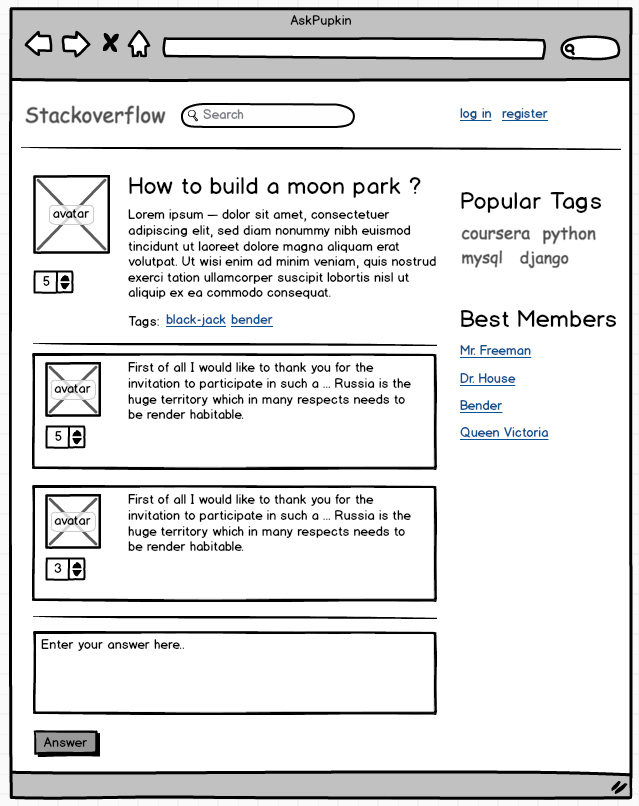

## Создание статической верстки сайта

В задании представлен mockup, то есть идеального соответствия между макетом и результатом не должно быть, должны 
быть выполнены критерии проверки. Дизайн остается на волю слушателя. 

Необходимо сверстать страницу вопроса сервиса с вопросами, аналогично популярному сервису stackoverflow.
[Пример](https://stackoverflow.com/questions/55685341/testing-in-django) 

Для выполнения домашнего задания необходим шаблон.

Результатом домашнего задания должен быть архив c двумя файлами index.html и index.css

### Исходный mockup, который необходимо сверстать

### Mockup, размеченный по блокам, для проверки задания

Обратите внимание на то, что расположенные под изображением аватара рейтинг, кнопки лайка и дизлайка вопроса должны 
быть рабочими. 